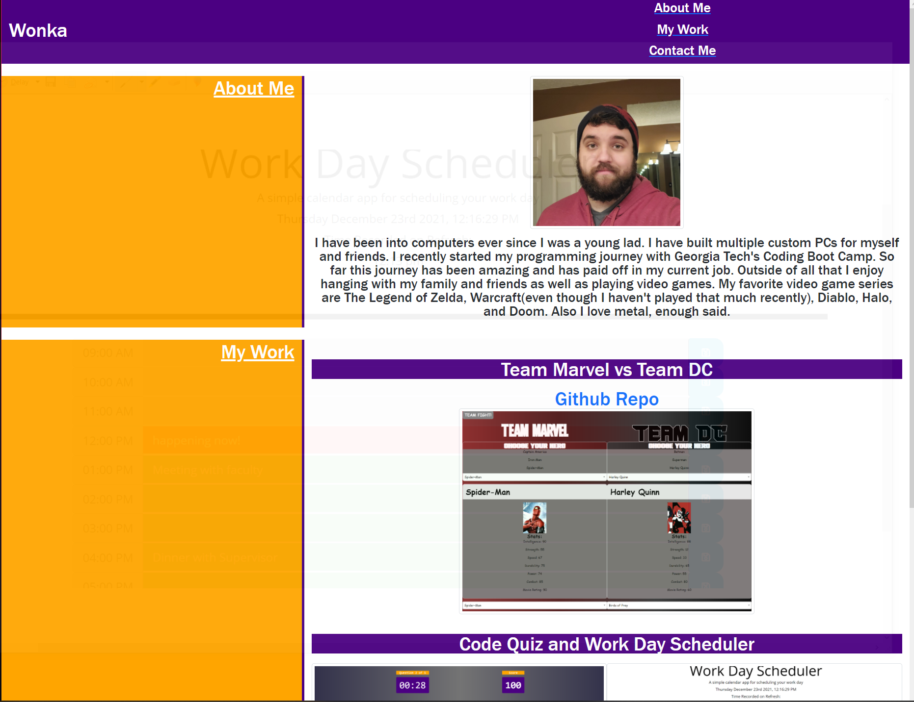
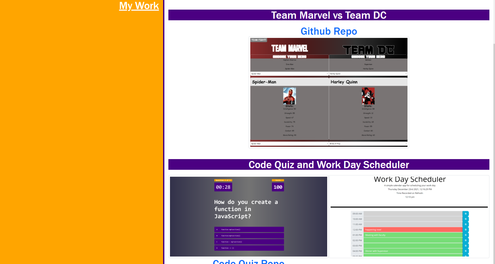

# HW2-Portfolio

## Description

This is my current portfolio including a BIO, links to github repos, links to deployed applications, and contact information. 

## Usage

Click on the links found in the top right to take you directly to the desired section. Click on the first image to be taken to the Team Marvel vs DC working page.

The next 2 images link to the deployed pages for code-quiz and day-scheduler apps.

To find my contact information you will have to navigate to the contact me section

## Technologies Used

I utilized bootstrap for the structuring of the page.
Custom CSS for most of the design elements.
